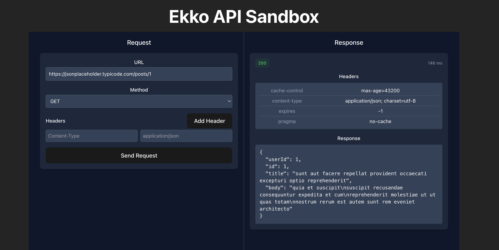

# Ekko API Sandbox

A lightweight, browser-based API testing tool for the Ekko API Suite, inspired by Postman but optimized for simplicity.



## Overview

This sandbox provides a clean, intuitive interface for testing API endpoints without requiring Postman or other external tools. It allows developers and non-technical users alike to:

- Make API requests using any HTTP method (GET, POST, PUT, DELETE, PATCH)
- Set custom headers and request bodies
- View formatted response data, headers, and status codes
- Monitor response times for performance testing

## Features

- **Simple, Two-Panel Interface**: Request configuration on the left, response data on the right
- **Dynamic Form Controls**: Show/hide appropriate input fields based on the selected HTTP method
- **Header Management**: Easily add, edit, and remove request headers
- **JSON Formatting**: Automatic pretty-printing of JSON responses
- **Status Code Highlighting**: Color-coded status indicators (green for success, yellow for redirects, red for errors)
- **Response Metrics**: View response time in milliseconds
- **Error Handling**: Clear display of request/response errors

## Tech Stack

- **React** + **TypeScript**: For a robust and type-safe frontend
- **Vite**: Fast build tooling and development server
- **React Query**: For efficient server state management and caching
- **Axios**: For making HTTP requests
- **React Hook Form**: For form state management
- **Tailwind CSS**: For responsive styling
- **MSW (Mock Service Worker)**: For API mocking during development

## Getting Started

### Prerequisites

- Node.js (v18+)
- npm or yarn

### Installation

1. Clone the repository:

```bash
git clone https://github.com/your-username/ekko-api-sandbox.git
cd ekko-api-sandbox
```

2. Install dependencies:

```bash
npm install
# or
yarn
```

3. Start the development server:

```bash
npm run dev
# or
yarn dev
```

4. Open your browser and navigate to `http://localhost:5173` (or the port shown in your terminal).

## Usage

### Making an API Request

1. Enter the API endpoint URL in the URL field
2. Select the HTTP method from the dropdown (GET, POST, PUT, DELETE, PATCH)
3. Add any required headers (e.g., Content-Type: application/json)
4. For POST, PUT, or PATCH requests, enter the request body in JSON format
5. Click "Send Request" to make the API call

### Viewing the Response

After sending the request, the right panel will display:

- HTTP status code and message
- Response time (in milliseconds)
- Response headers
- Formatted response body (JSON)

## Development

### Project Structure

```
ekko-api-sandbox/
├── public/             # Public assets
│   └── mockServiceWorker.js  # MSW service worker
├── src/
│   ├── components/     # React components
│   │   ├── api/        # API-related components
│   │   │   ├── RequestForm.tsx    # Form for API requests
│   │   │   └── ResponseViewer.tsx # Component for displaying responses
│   │   ├── layout/     # Layout components
│   │   │   └── ApiSandboxLayout.tsx # Main two-panel layout
│   │   └── ui/         # Reusable UI components
│   ├── hooks/          # Custom React hooks
│   │   └── useApiRequest.ts # Hook for making API requests
│   ├── services/       # Service modules
│   │   └── apiService.ts    # Axios wrapper for API requests
│   ├── mocks/          # MSW mock setup
│   │   ├── browser.ts  # Browser mock setup
│   │   └── handlers.ts # API mock handlers
│   ├── App.tsx         # Main application component
│   └── main.tsx        # Entry point with QueryClient setup
└── package.json        # Dependencies and scripts
```

### Available Scripts

- `npm run dev` - Start the development server
- `npm run build` - Build for production
- `npm run lint` - Run ESLint to check code quality
- `npm run preview` - Preview the production build locally

